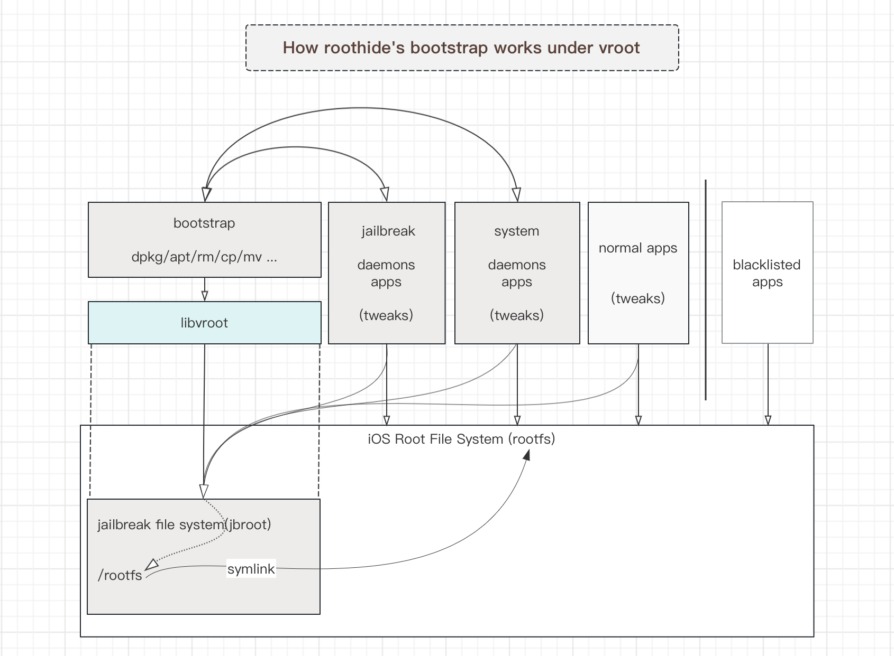

# vroot

vroot is a shim library for c/c++ programs/modules, 
it changes the default root of file system for programs/modules by replacing all system APIs related to file paths at compile/build time.
it implements nearly 200 system APIs in roothide at present, 
it's mainly designed for bootstrap, and most of the packages in procrusus come from gnu or other open source C/C++ projects, 
it can fully meet the needs.

# details

# develop with libvroot

when specifying rootide as the target to compile procursus/bootstrap, 
vroot will be applied to all programs/libraries by default, you can exclude specific packages from using vroot (such as those packages written specifically for iOS using objc/swift).
you can also apply libvroot to your C/C++ programs/modules in theos/xcode.
